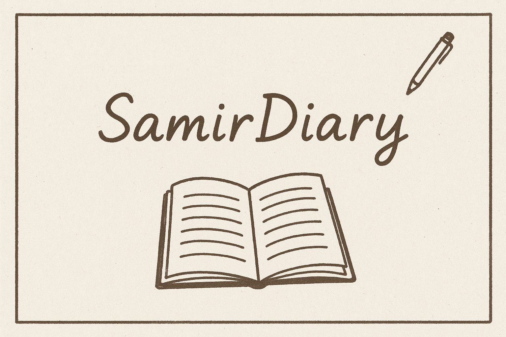

# SamirDiary 📖

A personal diary website where I share my thoughts, experiences, and reflections on life. Built with modern web technologies and designed for authentic self-expression.

## 🌟 About This Diary

Welcome to my digital diary! This is my personal space where I document my journey, share my opinions on various topics, and reflect on the experiences that shape me. Some entries are deeply personal and introspective, while others are more public musings on topics that interest me.

## 📚 What You'll Find Here

In this diary, you'll discover:

- **Personal Reflections** - Deep thoughts on life, growth, and experiences
- **Technology Musings** - Thoughts on tech, culture, and society
- **Creative Writing** - Poetry, stories, and creative expressions
- **Travel Experiences** - Adventures and discoveries from my journeys
- **Book Reviews** - Thoughts on books that have influenced me
- **Random Musings** - Daily observations and insights
- **Lessons Learned** - Wisdom gained from life experiences

## 🚀 Tech Stack

**Framework** - [Astro](https://astro.build/)  
**Styling** - [TailwindCSS](https://tailwindcss.com/)  
**Type Safety** - [TypeScript](https://www.typescriptlang.org/)  
**Search** - [Pagefind](https://pagefind.app/)  
**Comments** - Facebook Comments Plugin  
**Icons** - [Tabler Icons](https://tabler-icons.io/)  
**Deployment** - [Vercel](https://vercel.com/)

## 🙏 Acknowledgments

- Built with the beautiful [AstroPaper](https://github.com/satnaing/astro-paper) theme by [Sat Naing](https://github.com/satnaing)
- Icons by [Tabler Icons](https://tabler-icons.io/)
- Styling with [TailwindCSS](https://tailwindcss.com/)

---

Managed with ❤️ by [Samir](https://samirxyz.info) - A journey of self-discovery through writing.
